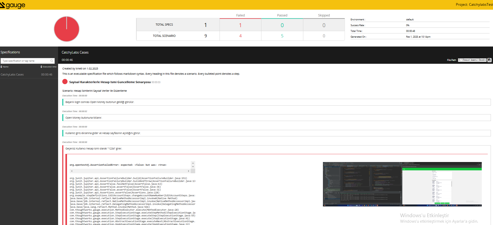

# 🚀 Gauge + Selenium + Maven Test Automation

This is a template to get started with a **Gauge project** that uses **Selenium** for browser interactions and **Maven** for dependency management.

## 📥 Installing Gauge & Required Plugins

First, install **Gauge** and required dependencies:

## About this template

This is a template to get started with a Gauge project that uses Selenium as the utils to interact with a web browser.

## Installing this template

    gauge --install java_maven_selenium

## Building on top of this template

### Defining Specifications

* This template includes a sample specification which opens up a browser and navigates to `Get Started` page of Gauge.
* Add more specifications on top of sample specification.

Read more about [Specifications](http://getgauge.io/documentation/user/current/specifications/README.html)

### Writing the implementations

This is where the java implementation of the steps would be implemented. Since this is a Selenium based project, the java implementation would invoke Selenium APIs as required.

_We recommend considering modelling your tests using the [Page Object](https://github.com/SeleniumHQ/selenium/wiki/PageObjects) pattern, and the [Webdriver support](https://github.com/SeleniumHQ/selenium/wiki/PageFactory) for creating them._

- Note that every Gauge step implementation is annotated with a `Step` attribute that takes the Step text pattern as a parameter.
  Read more about [Step implementations in Java](http://getgauge.io/documentation/user/current/test_code/java/java.html)

### Execution

* You can execute the specification as:

```
mvn test
```


```sh
gauge install java
gauge install html-report
gauge install screenshot

mvn clean install

/CatchylabsTest
│── /specs            # Specification files (Gauge scenarios)
│── /src/main/java
│   │── /pages        # Page Objects (Selenium)
│   │── /utils        # Helper functions (WebDriver, Config, etc.)
│── /src/test/java
│   │── /stepDefinitions  # Gauge step implementations
│── pom.xml           # Maven dependencies
│── README.md         # Project documentation
│── reports/          # Test execution reports (Gauge HTML)


 Run Tests & Generate HTML Reports

gauge run specs --html-report
reports/html-report/index.html
gauge run specs --clean
gauge run specs --html-report
{your_project_directory}/reports/html-report/index.html


Bu **README.md** dosyasıyla:
✅ **Gauge testlerini çalıştırabilir**,  
✅ **Raporları görüntüleyebilir**,  
✅ **Eski test raporlarını temizleyebilir** ve  
✅ **Karşılaşabileceğin yaygın sorunları giderebilirsin**.


